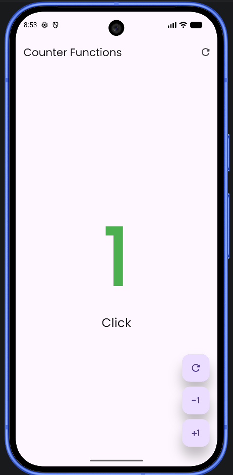
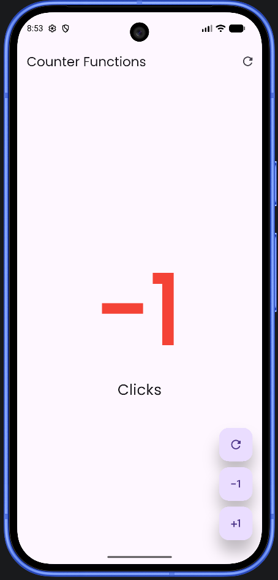
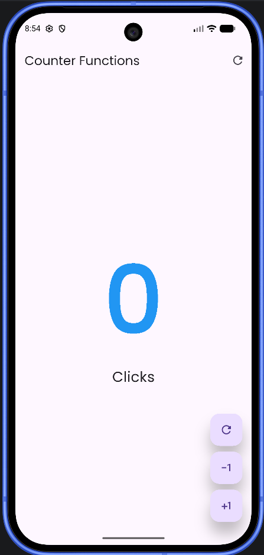

# Counter Functions - Flutter

## Descripción

Aplicación desarrollada en **Flutter** que funciona como un contador.

Permite:

- Aumentar el contador.
- Disminuir el contador.
- Reiniciar el contador a cero.
- Cambiar el color del número dependiendo de su valor.

---

## Funcionamiento

El contador inicia en `0`.

Los botones permiten aumentar, disminuir o reiniciar el valor.

El color cambia de la siguiente manera:

| Valor | Color |
|---|---|
| `0` | Azul |
| Mayor que `0` | Verde |
| Menor que `0` | Rojo |

La interfaz se actualiza utilizando `setState()`.

También se utiliza **Google Fonts** para cambiar el estilo del número mostrado.

---

## Evidencias

### Contador en cero

El contador inicia en `0` y se muestra en color **azul**.

### Contador positivo

Cuando el valor es mayor que `0`, el número cambia a color **verde**.

### Contador negativo

Cuando el valor es menor que `0`, el número cambia a color **rojo**.

### Reinicio del contador

Al presionar el botón de reinicio, el contador vuelve a `0` y cambia nuevamente a color **azul**.

---

## Resultado

Se obtuvo una aplicación de contador que permite modificar su valor y cambiar dinámicamente el color dependiendo de si el número es positivo, negativo o igual a cero.